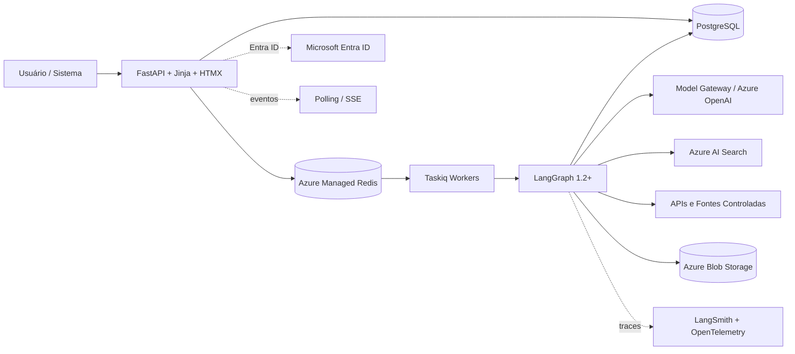
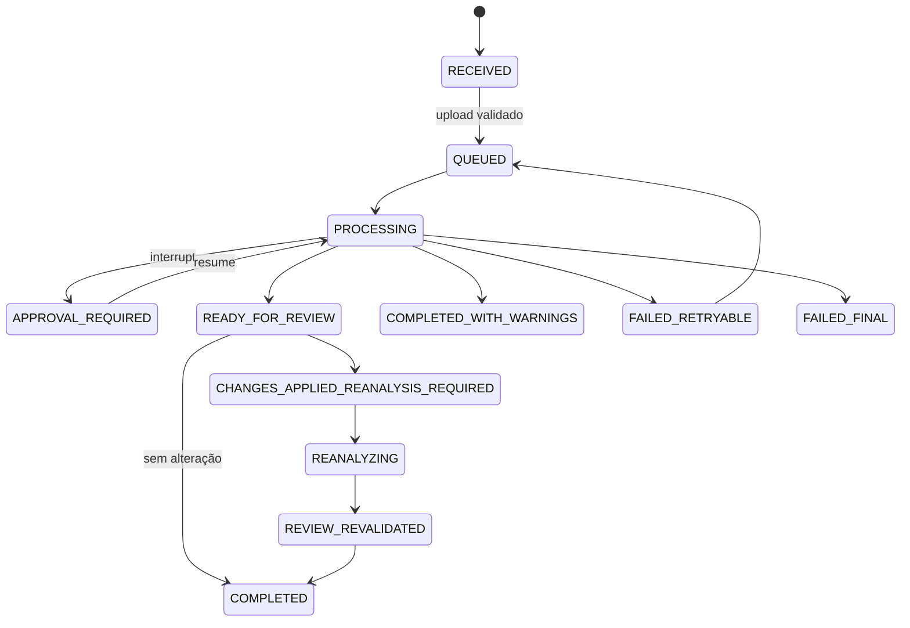
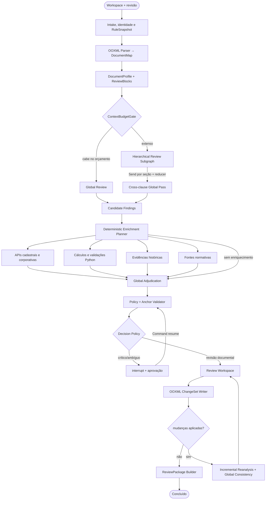

# Design Architecture: Contract Analyzer Enterprise

## 🎯 Objetivo (Problema de Negócio)
Automatizar, padronizar e auditar a revisão de contratos B2B em ambiente corporativo, transformando DOCX extensos, tabelas, anexos e revisões preexistentes em achados rastreáveis, propostas de redação e decisões humanas verificáveis. A solução confronta o conteúdo contratual com regras internas versionadas, cálculos determinísticos, cadastros autorizados, fontes normativas controladas e exemplos históricos aprovados, preservando contexto global, referências cruzadas, autoria, vigência e origem de cada evidência.

O produto atua como **estação de trabalho de Compliance e revisão jurídica assistida**: organiza o `ContractWorkspace`, executa análises completas ou focais, explica divergências com linguagem qualificada, permite interação contextual e materializa comentários ou *Track Changes* no Word. A IA não calcula valores, não escolhe fontes silenciosamente, não publica regras, não aprova contratos e não produz parecer jurídico conclusivo; o controle permanece com o usuário por mecanismos *Human-in-the-Loop* transacionais e documentais.

## 📌 Premissas e Decisões

* **Arquitetura-alvo 1.2+:** Este documento descreve a entrega final planejada das releases atuais, não MVP, protótipo ou SaaS futuro; PDF/OCR, assinatura digital, criação integral de contratos e CLM permanecem fora deste horizonte.
* **LangGraph 1.2+ como orquestrador explícito:** `StateGraph` com estado tipado, `context_schema`, rotas condicionais, `Send`, reducers idempotentes, subgrafos, checkpoints, streaming e `interrupt()`/`Command(resume=...)`; não é um agente ReAct irrestrito nem um conjunto decorativo de prompts.
* **Ports & Adapters, Azure-first:** domínio, grafo e contratos não dependem do provedor; produção utiliza Microsoft Azure, enquanto adaptadores locais sustentam desenvolvimento, testes e execução degradada sem alterar os nós.
* **Unidade de negócio (`ContractWorkspace`):** um DOCX principal editável e zero ou mais DOCX relacionados (anexos, aditivos, renovações, propostas ou instrumentos de suporte), todos versionados e com proveniência independente; não substitui um CLM.
* **OOXML antes da semântica:** Python constrói `DocumentMap` estável sobre partes, parágrafos, tabelas, células, runs, comentários e revisões. A IA pode propor `ReviewBlock`s semânticos, mas nunca redefine a identidade física nem cria apontamentos sem âncora verificável.
* **Contexto global por padrão:** contrato integral quando couber no orçamento; `ContextBudgetGate` direciona documentos extensos para subgrafo hierárquico por seções, com análise paralela e passagem global obrigatória para contradições, definições, anexos e referências distantes.
* **Revisão completa e focal:** toda execução completa avalia as regras aplicáveis do snapshot; o usuário também pode solicitar análise focal por regra, categoria, seção ou bloco, sempre com expansão controlada do contexto relacionado e sem chat aberto fora do domínio.
* **Rule Registry governado:** regras corporativas append-only com escopo, vigência, criticidade, aplicabilidade, exceções, dependências, fontes permitidas e política de saída; cada execução congela um `RuleSnapshot` imutável. Conflitos não são resolvidos silenciosamente: precedência explícita ou decisão humana.
* **Papéis lógicos de modelos:** `fast_structured_model`, `global_review_model`, `adjudication_model`, `specialized_reasoning_model` e `embedding_model`; deployments podem diferir no mesmo fluxo e são escolhidos por política determinística, benchmark e lifecycle, nunca hardcoded no domínio.
* **Structured Output obrigatório:** Pydantic/JSON Schema com estratégia nativa do provider quando disponível e fallback controlado por tool schema; IDs, enums, âncoras e solicitações de enriquecimento são validados em Python, com retries limitados e recusa de campos não declarados.
* **Ferramentas sob controle do grafo:** APIs, cálculos, recuperação histórica, persistência, ancoragem e Writer são nós determinísticos. O LLM identifica candidatos e entidades, mas `EnrichmentPlanner` decide o que pode ser executado segundo a regra, allowlists, orçamento e permissões.
* **RAG como evidência auxiliar:** Azure AI Search recupera de zero a três exemplos históricos aprovados, preferencialmente parágrafos com comentário ou alteração humana, usando busca híbrida, filtros e controle de acesso; similaridade não determina a ação e contrato anterior não é *ground truth* universal.
* **Fontes normativas controladas:** políticas, manuais e regulamentos são indexados com versão, vigência, URL, hash e data de captura. Não há busca aberta na internet durante a revisão nem fundamentação sem citação reproduzível.
* **Decisão orientada por evidências:** risco, criticidade da regra, `similarity_score`, qualidade de âncora, validação determinística, autoridade/frescor da fonte e `decision_score` são conceitos separados; nenhum número declarado pelo LLM equivale a probabilidade jurídica.
* **HITL híbrido:** o portal pausa decisões críticas via checkpoint e aprovação; o Word oferece comentários, *Track Changes* e round-trip opcional. Sugestão permanece atribuída ao `Contract Analyzer`; aceite, rejeição ou edição ficam atribuídos ao usuário autenticado, sem serem tratados como assinatura digital.
* **Original imutável e múltiplas visões:** interface alterna `Original`, `Revisão` e `Prévia limpa`; exportação gera original, DOCX marcado, DOCX limpo, JSON, evidências e manifesto. Aprovação em massa alcança apenas sugestões elegíveis e exige confirmação auditável.
* **Reanálise conservadora:** alterações invalidam achados e caches dependentes; o sistema reprocessa unidades afetadas e executa passagem global de consistência. Quando dependências não forem confiáveis, faz revisão integral; resultados não revalidados permanecem explicitamente obsoletos.
* **Human-in-command:** análise focal, mudança de lente, geração de cláusula, consulta adicional, aplicação em massa e promoção de feedback exigem ação explícita. Perfis de revisão alteram ênfase e explicação, nunca fatos, regras obrigatórias ou autorização.
* **Feedback supervisionado:** decisões, comentários e round-trip alimentam datasets, simulação de impacto e propostas de melhoria; prompt, regra, exemplo histórico ou modelo não são promovidos automaticamente.
* **Single-organization com escopos internos:** autenticação e RBAC corporativos permitem isolamento por área, unidade, família contratual, jurisdição e grupo; multi-tenant comercial, billing e isolamento SaaS não integram o produto.

## ⚙️ Escopo da Solução

* **In:** autenticação corporativa; criação de workspace; upload do DOCX principal e relacionados; revisão completa com todas as regras aplicáveis ou escopo focal autorizado por regra/categoria/bloco; lente, decisões humanas, reimportação de DOCX e feedback contextual.
* **Core:** ingestão segura; parsing OOXML; `DocumentMap`/`DocumentProfile`; agrupamento semântico; planejamento de contexto; revisão direta ou hierárquica; enriquecimentos determinísticos e RAG; adjudicação; política HITL; Writer OOXML; reanálise incremental; governança de regras, evidências e modelos.
* **Out:** estação web com fila, blocos, antes/depois, evidências, pílulas e histórico; comentários/*Track Changes*; `ReviewPackage` com versões original, marcada e limpa, `findings.json`, `evidence.json`, `manifest.json` e resumo HTML; eventos e APIs para integrações.
* **Fora do Escopo:** PDF/OCR e conversão fiel para DOCX; autenticação de assinatura manuscrita ou validação criptográfica de assinatura digital; criação integral de contratos, negociação colaborativa, assinatura eletrônica e CLM; parecer jurídico conclusivo; aprovação autônoma; alteração automática de regras; busca web irrestrita; agente SQL/Text-to-SQL; SaaS multi-tenant; aprendizado não supervisionado.

## 👥 Usuários e Papéis

1. **Analista Jurídico / Compliance (`reviewer`):** cria workspaces, executa revisões, investiga blocos, decide achados, solicita redações alternativas, reanalisa e exporta entregáveis.
2. **Aprovador / Especialista (`approver`):** resolve interrupções críticas, exceções, alçadas, conflitos de fonte e alterações de alto impacto; não recebe permissão implícita para publicar regras.
3. **Gestor de Compliance (`rule_manager`):** mantém regras e fontes em rascunho, simula impacto, aprova/publica/retira versões, governa exemplos históricos e acompanha qualidade por regra.
4. **Desenvolvedor / Administrador (`developer_admin`):** configura adapters, modelos, prompts, índices e retenção; acessa `DocumentMap`, traces higienizados, avaliações, conversores e gerador de casos adversariais, sem expor segredos ou conteúdo não autorizado.
5. **Sistemas corporativos:** CLM/ERP/SharePoint/cadastros podem criar workspaces, fornecer metadados e consumir resultados por API; serviços externos somente respondem às consultas permitidas e nunca interagem diretamente com o LLM.

## 🧩 Modelo de Domínio e Dados

### Arquitetura de Implantação



* **Compute:** imagens Docker; API/UI e workers em Azure Container Apps separados, com escala HTTP/queue e rede privada. Perfil local equivalente via Docker Compose.
* **PostgreSQL Flexible Server:** OLTP, Rule Registry, jobs, decisões, auditoria, dependências, metadados e `AsyncPostgresSaver`; arquivos e payloads grandes não ficam no estado relacional.
* **Azure Blob Storage / MinIO local:** originais, revisões, pacotes, fontes controladas e artefatos de avaliação; conteúdo endereçado por hash e nunca sobrescrito destrutivamente.
* **Azure Managed Redis / Redis local:** broker Taskiq, sinais de fila e cache efêmero; não é fonte da verdade do job, checkpoint ou decisão humana.
* **Azure AI Search:** índices separados para evidências históricas e fontes normativas, busca textual/vetorial híbrida, semantic ranking quando validado, filtros por escopo e segurança documental.
* **Model Gateway:** LangChain model interface com adapters Azure e locais; deployments resolvidos por `ModelPolicy`, `Runtime Context` e configuração externa.
* **Identidade e segredos:** Entra ID, app roles/grupos, Managed Identity, RBAC e Key Vault apenas para segredos inevitáveis; private endpoints/VNet conforme criticidade.
* **Observabilidade:** LangSmith para traces/evaluations e OpenTelemetry para métricas/logs distribuídos; conteúdo contratual e mapas de pseudonimização são minimizados ou omitidos.

### Entidades Principais

* `OrganizationScope`: `scope_id`, `parent_id`, `scope_type` (ORG/UNIT/DEPARTMENT/CONTRACT_FAMILY/JURISDICTION), `entra_group_ids`, `classification`, `active`.
* `ContractWorkspace`: `workspace_id`, `scope_id`, `title`, `primary_document_id`, `related_document_ids`, `owner_id`, `status`, `created_at`, `retention_policy_id`.
* `DocumentRevision`: `document_id`, `revision_id`, `parent_revision_id`, `role` (PRIMARY/ANNEX/AMENDMENT/RENEWAL/REFERENCE), `storage_uri`, `sha256`, `mime`, `source`, `created_by`, `created_at`.
* `DocumentUnit`: `unit_id`, `revision_id`, `part_uri`, `unit_type` (PARAGRAPH/TABLE/ROW/CELL/RUN_RANGE/HEADER/FOOTER/HYPERLINK), `parent_id`, `order`, `style`, `text_original`, `text_current`, `text_normalized`, `char_map`, `ooxml_locator`, `existing_event_ids`, `unsupported_flags`.
* `DocumentEvent`: `event_id`, `revision_id`, `unit_id`, `event_type` (COMMENT/REPLY/INSERTION/DELETION/FORMAT_CHANGE), `author`, `event_at`, `char_range`, `before`, `after`, `text`, `status`, `ooxml_locator`; preserva comentários e Track Changes preexistentes ou reimportados.
* `ReviewBlock`: `block_id`, `revision_ids`, `block_type` (TITLE/SUBTITLE/SECTION/CLAUSE/SUBPARAGRAPH/DEFINITION/OBLIGATION/TABLE_ROW/TABLE_SECTION/ANNEX_REFERENCE), `title`, `unit_refs`, `related_block_ids`, `semantic_summary`, `construction_mode`, `anchor_quality`.
* `DocumentProfile`: partes e identificadores, papéis, objeto, tipo contratual, idioma, datas, vigência, renovação, valores/moeda, foro/jurisdição, índices, anexos, signatários declarados, blocos de assinatura, seções, referências, tabelas, comentários/revisões existentes, conteúdo não suportado e estimativa de tokens; todo campo possui `evidence_refs`.
* `RuleRelease`: `rule_id`, `version`, `title`, `description`, `category`, `scope`, `applicability`, `criticality`, `expected_behavior`, `finding_guidance`, `explicit_exceptions`, `dependencies`, `supersedes`, `requires_api`, `api_validation_type`, `historical_evidence_eligible`, `normative_source_ids`, `output_policy`, `status`, `valid_from/to`, `author_id`, `approver_id`.
* `SourcePolicy`: `policy_id/version`, autoridades aceitas, precedência, vigência, tolerância a conflito, freshness/TTL, campos comparáveis e comportamento quando indisponível; fonte histórica nunca substitui regra ou fonte oficial.
* `PromptRelease` / `ModelPolicy`: papéis lógicos, prompt/schema versions, deployments permitidos, budget, fallback, critérios de seleção e datasets mínimos; troca exige regressão.
* `RuleSnapshot`: `snapshot_id`, `workspace_id`, `rule_release_ids`, `rules_hash`, `source_policy_version`, `prompt_policy_version`, `created_at`; imutável durante a execução.
* `ReviewRun`: `run_id`, `workspace_id`, `thread_id`, `run_type` (FULL/FOCAL/REVALIDATION/ROUND_TRIP/RULE_SIMULATION), `review_scope`, `lens`, `rule_snapshot_id`, `input_revision_ids`, `graph_version`, `state_schema_version`, `status`, `started_at`, `finished_at`.
* `RuleEvaluation`: `evaluation_id`, `run_id`, `rule_id/version`, `status` (COMPLIANT/FINDING/NOT_APPLICABLE/UNAVAILABLE/INSUFFICIENT_EVIDENCE), `availability_reason`, `finding_ids`, `evidence_ids`.
* `Finding`: `finding_id`, `evaluation_id`, `rule_id/version`, `category`, `qualified_statement`, `risk_level`, `decision_score`, `observed_text`, `unit_refs`, `char_ranges`, `related_findings`, `limitations`, `suggested_action`, `suggested_clause`, `status`.
* `Evidence`: `evidence_id`, `type` (DOCUMENT/API/CALCULATION/HISTORICAL/NORMATIVE/HUMAN), `source_id`, `source_version`, `authority`, `valid_at`, `retrieved_at`, `content_hash`, `excerpt`, `unit_refs`, `url`, `similarity_score`, `access_scope`, `raw_payload_uri`.
* `EnrichmentRequest/Result`: `request_id`, `finding_id`, `provider`, `operation`, `validated_inputs`, `status`, `attempts`, `observed_at`, `normalized_result`, `raw_payload_uri`, `error_code`.
* `ChangeProposal`: `proposal_id`, `finding_id`, `operation` (COMMENT/INSERT/DELETE/REPLACE/CLAUSE_DRAFT), `before`, `after`, `anchor`, `suggested_by`, `status` (SUGGESTED/APPROVED/REJECTED/EDITED/APPLIED/REVERTED/SUPERSEDED), `approved_by/at`, `bulk_decision_id`.
* `HumanDecision`: `decision_id`, `actor_id`, `decision_type` (ACKNOWLEDGE_FINDING/REJECT_FINDING/APPROVE_CHANGE/EDIT_CHANGE/APPROVE_EXCEPTION/APPROVE_CONTRACT), `target_id`, `scope`, `reason`, `input_hash`, `created_at`; decisões distintas nunca são colapsadas em um único “aceite”.
* `DependencyEdge`: `edge_id`, `from_type/id`, `to_type/id`, `relation` (DEPENDS_ON/DERIVED_FROM/CONTRADICTS/INVALIDATES/REFERENCES), `strength`, `source`, `created_at`; sustenta `EvidenceGraph` e reanálise incremental.
* `InteractionThread`: `interaction_id`, `workspace_id`, `block_id`, `actor_id`, `question`, `context_refs`, `answer`, `next_actions`, `run_id`; somente perguntas de domínio e ações tipadas.
* `ExecutionManifest`: versões/hashes de grafo, estado, parser, Writer, regras, prompts, schemas, modelos/deployments, embeddings, índices e fontes; tokens, custo, cache, tempos, limitações e IDs de trace.
* `IntegrationEvent` (Outbox): `event_id`, `aggregate_id`, `event_type`, `payload_version`, `idempotency_key`, `status`, `attempts`, `next_retry_at`, `last_error`; publica conclusão, aprovação ou falha sem perder consistência transacional.
* `ReviewPackage`: `package_id`, `workspace_id`, `run_id`, `original_uri`, `redline_uri`, `clean_uri`, `findings_uri`, `evidence_uri`, `manifest_uri`, `summary_uri`, `hashes`, `validation_status`.

### Estado do Grafo e Dependências

* **`ContractState` (mutável/checkpointado):** IDs do workspace/run, snapshot, mapa/profile compactos ou referências, plano de contexto, candidatos, avaliações, solicitações/resultados de enriquecimento, evidências, achados, decisões pendentes, propostas, invalidações, erros controlados e métricas. Grandes XMLs, arquivos e respostas brutas permanecem no storage.
* **Reducers:** resultados paralelos usam chaves por `request_id`; achados usam `merge_findings_by_id`, evitando duplicação em retries, resumes e subgrafos. `operator.add` não é adotado sem identidade e deduplicação.
* **`Runtime Context` (imutável):** repositories, model roles, storage, search, API providers, clock, identity e feature policies; clientes, conexões e segredos nunca entram no checkpoint.
* **`RunnableConfig`:** `thread_id`, tags, metadados de tracing, limites e correlação. Nomes de nós e schemas evoluem com compatibilidade para não invalidar threads interrompidas.

### Máquinas de Estados



```text
RuleRelease: DRAFT → IN_REVIEW → PUBLISHED → RETIRED; alteração cria nova versão.
DocumentRevision: ORIGINAL → SYSTEM_REDLINE/SYSTEM_CLEAN → HUMAN_REVISED → REVALIDATED; nenhuma revisão sobrescreve a anterior.
Resultado: CURRENT → STALE → RECALCULATING → SUPERSEDED/REVALIDATED; cache não altera o estado de verdade.
```

## 🔌 Serviços de Aplicação e Integrações

### Orquestração Principal



* **Parsing e blocos:** `DocxParserPort` percorre o pacote OOXML, normaliza texto visível e mantém mapa normalizado→original→run. `SemanticBlockBuilder` usa saída estruturada para agrupar unidades em blocos sobreponíveis; Python valida todas as referências.
* **Perfil documental:** extração assistida produz fatos com evidências, não um resumo livre. Campos sem suporte ou ambíguos permanecem `unknown`, `conflicting` ou `insufficient_evidence`.
* **Contexto extenso:** o subgrafo hierárquico divide por estrutura real, usa `Send` para passes locais, reducers customizados e revisão global final. Não há truncamento silencioso nem agente por parágrafo; o parágrafo é âncora, não unidade autônoma de decisão.
* **Revisão e perfis:** `ReviewLens` pode ser NEUTRAL, CONTRACTING_PARTY, COUNTERPARTY, CRITICAL, FOUNDATION, CONCILIATOR ou DIDACTIC. A lente altera prioridade, explicação e sugestões; Compliance obrigatório e evidências permanecem iguais.
* **Subgrafos especializados:** famílias independentes (cadastral/representação, financeira, coerência jurídica, normativa) podem usar prompts/modelos próprios quando a regra e o benchmark justificarem. Para achados ambíguos de alto impacto, um subgrafo multiperspectiva é opcional e termina em adjudicação neutra.
* **Planejamento determinístico:** `RuleRelease` e entidades validadas geram `EnrichmentRequest`; API/RAG não são chamadas porque o modelo “quis”. Solicitações adicionais do Revisor retornam como schema, passam por allowlist e têm no máximo iterações configuradas.
* **Validações clássicas:** CPF/CNPJ, datas, placeholders, formatação, somas de tabelas/anexos, faixas, alçadas, índices e tolerâncias usam Python/Decimal e registram `DeterministicValidationPlan`; a IA não recalcula números na narrativa.
* **Fontes externas:** `CompanyRegistryProvider`, `PostalAddressProvider`, `MunicipalityProvider`, `RepresentationAuthorityProvider`, `SanctionsProvider` e adapters internos preservam timestamp, validade, payload e erro. Ausência de fonte legítima retorna `UNAVAILABLE`, nunca inferência de titularidade ou poder.
* **Política de autoridade:** regras definem fontes aceitas, vigência e precedência; histórico é apenas precedente contextual. Divergência entre contrato, anexo, cadastro interno, API e norma permanece explícita até resolução, sem substituição automática.
* **Evidência histórica:** ingestão extrai parágrafo completo, original/final, comentário, inserção/exclusão, autor, data, tipo contratual, contraparte, regra e escopo. Consulta filtra por regra, família contratual, contraparte/cliente, vigência e evento quando autorizado. Exemplos exigem aprovação, podem ser retirados e não são indexados apenas porque um contrato “parece aprovado”.
* **Normas e manuais:** pipeline controlado cria snapshots verificáveis; resposta cita fragmento, versão e URL. Mudança de fonte pode marcar resultados como `REPROCESS_RECOMMENDED`.
* **Adjudicação:** consolida todos os achados, resolve duplicidades e relações, qualifica linguagem e produz conformidades/indisponibilidades. `decision_score` serve para roteamento e UX, não aprova mudança crítica sozinho.
* **Criação de cláusula:** `ClauseComposer` é acionado pelo usuário sobre achado selecionado, regras publicadas e fontes autorizadas; gera proposta rastreável e não cria contrato completo nem aplica alteração sem decisão. Metaprompt/reverse prompting e casos adversariais existem somente no ciclo offline de avaliação e publicação supervisionada.

### Human-in-the-Loop e Word

* **Hard HITL:** `DecisionPolicy` chama `interrupt()` para regra crítica, conflito de autoridade, exceção, alçada, alteração material ou evidência insuficiente configurada. O estado fica no Postgres; `/resume` registra decisão e enfileira retomada com `Command(resume=...)`. Código anterior ao interrupt é idempotente.
* **Soft HITL:** resultados chegam ao portal e ao DOCX; usuário reconhece/rejeita achado, aprova/rejeita/edita redação e, separadamente, aprova exceção ou contrato. “Aprovar tudo” seleciona apenas propostas elegíveis, mostra impacto e exige confirmação; itens críticos permanecem individuais/hierárquicos.
* **Autoria:** comentários e revisões geradas são de `Contract Analyzer`; `HumanDecision` registra quem aprovou, quando e sobre qual hash. Metadado de revisão não é assinatura eletrônica, certificado ou não repúdio.
* **Writer:** `python-docx` cobre comentários e alto nível; camada OOXML controla `<w:ins>/<w:del>`, runs, tabelas e preservação de estilos. Âncora inválida pode subir ao parágrafo validado com aviso; sem `unit_id` válido, retorna `anchor_failure` e não procura texto “parecido”.
* **Visões/exports:** navegador alterna Original/Revisão/Prévia limpa sobre `DocumentViewModel`; fidelidade final é o Word. `redline.docx` preserva revisões; `clean.docx` materializa apenas mudanças aprovadas; ambos referenciam o original e o manifesto por hash.
* **Round-trip:** reimportar o Word cria nova `DocumentRevision`, extrai respostas, aceitações/rejeições e edições manuais quando observáveis, reconcilia com propostas anteriores e solicita confirmação para correspondências ambíguas.

### Reanálise, Dependências e Cache

* `EvidenceGraph` liga unidades, regras, cálculos, fontes, achados, propostas e decisões. Após mudança, `ReanalysisPlanner` invalida dependências transitivas e escolhe processamento incremental ou revisão integral conforme cobertura do grafo.
* A reanálise incremental recalcula unidades alteradas, entidades, APIs afetadas, retrieval e regras dependentes; uma passagem global menor sempre verifica novas contradições, referências quebradas e mudança de aplicabilidade.
* Se o usuário exportar sem revalidar, pacote recebe `DRAFT_NOT_REVALIDATED`; “limpo e validado” só é emitido após `REVIEW_REVALIDATED`.
* Caches são efêmeros e versionados por `input_hash`, regra, parser, prompt, modelo/deployment, índice, fonte e TTL. Prompts mantêm prefixos estáveis para aproveitar caching nativo quando suportado; respostas semânticas não são reutilizadas entre contratos e cache nunca é memória institucional.

### Ports & Adapters

* `DocumentStoragePort`: `AzureBlobStorageAdapter` / `MinioLocalAdapter`.
* `WorkspaceRepository`, `RuleRegistryRepository`, `AuditRepository`, `DependencyRepository`: PostgreSQL; migrations e transações explícitas.
* `CheckpointPort`: `AsyncPostgresSaver`; implementação SQLite apenas para perfil local/testes.
* `JobDispatcherPort`: Taskiq com Azure Managed Redis/Redis; `BackgroundTasks` não executa revisões longas.
* `IdentityProviderPort`: Entra ID/MSAL e adapter local; roles e scopes resolvidos antes do grafo.
* `ModelGatewayPort`: roles lógicos via LangChain; structured output, budget, timeout, retry e fallback declarados.
* `HistoricalEvidencePort` / `NormativeSourcePort`: Azure AI Search com adapters locais equivalentes; filtros de segurança aplicados no servidor.
* `ExternalValidationPort`: adapters versionados, circuit breaker, rate limit, retries transitórios e idempotência.
* `DocxEnginePort`: parser, anchor validator, writer, differ e round-trip; nenhum LLM manipula XML diretamente.
* `TelemetryPort`: LangSmith/OpenTelemetry; modo desenvolvedor exibe apenas prompts, traces, custos e payloads higienizados autorizados.

## 📡 Contratos de API e Workers

### REST / HTML

* `POST /api/v1/workspaces` — cria workspace; `POST /workspaces/{id}/documents` — upload validado e versionado do DOCX principal/relacionado.
* `POST /workspaces/{id}/reviews` — inicia FULL/FOCAL com `202`, `idempotency_key`, lens e escopo; `GET /reviews/{run_id}` e `/events` — status, polling/SSE e interrupções.
* `GET /reviews/{run_id}/blocks|evaluations|findings|evidence` — áreas analíticas; `POST /findings/{id}/interactions` — pergunta contextual ou `next_action` tipada.
* `POST /findings/{id}/decisions` e `POST /reviews/{id}/bulk-decisions` — decisão individual/coletiva com pré-condição por hash, criticidade e autorização.
* `POST /reviews/{id}/resume` — decisão de Hard HITL; trava otimista impede retomada duplicada.
* `POST /workspaces/{id}/revisions/import` — round-trip; `POST /reviews/{id}/reanalyze` — revalidação incremental/integral.
* `GET /reviews/{id}/packages/{original|redline|clean|manifest|evidence}` — downloads autorizados e temporários; `POST /integrations/webhooks` — assinatura de eventos versionados por sistemas corporativos.
* `GET/POST /admin/rules`, `POST /admin/rules/{id}/simulate|publish|retire` — registry e impacto sobre golden dataset; publicação exige papel e aprovação.
* `GET/POST /admin/evidence`, `POST /admin/evidence/{id}/approve|revoke|reindex` — governança histórica/normativa; conteúdo não aprovado não entra em produção.
* `GET /developer/runs/{id}` e ferramentas de inspector/evaluation — acesso restrito, sanitizado e desabilitável.

### Workers

* `run_contract_review_task` — executa/reinicia o grafo; `resume_contract_review_task` — retoma thread interrompida.
* `build_review_package_task` — gera original/redline/clean/manifest de forma idempotente.
* `reanalyze_revision_task` — invalidação, reprocessamento e passagem global.
* `ingest_historical_evidence_task` / `ingest_normative_source_task` — extração, validação, aprovação e indexação versionadas.
* `simulate_rule_release_task` — compara regra/prompt/modelo contra datasets e versões anteriores antes da publicação.
* `publish_outbox_events_task` — entrega webhooks/eventos com idempotência, retry e dead-letter; `retention_cleanup_task` — exclusão/arquivamento conforme política e legal hold. Todos os jobs usam correlação e estados persistidos.

## 🛡️ Segurança e Restrições

* **Autenticação/autorização:** OIDC/OAuth2 via Entra ID; app roles e grupos; escopo mínimo por workspace, regra, fonte, documento e endpoint. Aprovação, publicação e acesso ao modo desenvolvedor exigem permissões distintas.
* **Identidade de serviço:** Managed Identity e RBAC para Blob, Search, PostgreSQL e demais serviços; Shared Keys desabilitadas quando possível; secrets no Key Vault, rotação e nenhum segredo em estado, prompt ou log.
* **Rede:** Container Apps, PostgreSQL, Storage, Search e modelos por VNet/private endpoints conforme política; TLS, egress controlado, DNS privado e ausência de acesso público desnecessário.
* **Uploads:** somente `.docx` válido; rejeição de `.docm`, executáveis, path traversal, ZIP bomb, relações externas não autorizadas, tamanho/expansão excessivos e MIME divergente; malware scan antes do parsing.
* **Privacidade/LGPD:** minimização, classificação, retenção, exclusão, legal hold e acesso auditado. Pseudonimização reversível é seletiva por regra/fonte; mapa fica segregado e nunca entra em traces ou índice.
* **Prompt injection:** contrato, comentário, exemplo e norma são conteúdo não confiável; instruções internas ficam separadas, retrieval traz dados sem autoridade de comando, saída é schema-validada e o modelo não recebe ferramentas arbitrárias.
* **Dados enviados ao modelo:** apenas texto visível e contexto necessário; OOXML bruto, respostas integrais de APIs, segredos, ACLs e mapas de identidade ficam locais. Dados completos permanecem no workspace e payloads externos são limitados.
* **Auditoria:** trilha append-only de upload, hashes, snapshots, modelo/deployment, prompt, regras, fontes, chamadas, decisões, exports, reimportações e reprocessamentos; não registra raciocínio oculto, apenas justificativa estruturada e evidências.
* **Fontes e temporalidade:** toda validação externa informa momento e disponibilidade; resultado atual não é aplicado retroativamente sem regra. Falha de API gera indisponibilidade, nunca conclusão inventada.
* **Writer seguro:** original é imutável; escrita ocorre em cópia; idempotency key e hash evitam duplicação; round-trip e clean export não equivalem a assinatura digital ou aprovação jurídica final.
* **Guardrails:** sem SQL livre, DML, browsing aberto, execução de código pelo modelo, loops ilimitados ou publicação automática. Orçamento por run/nó, timeout, retries, circuit breakers e cancelamento controlado.
* **Limitações permanentes:** assistente técnico, não advogado, perito grafotécnico, autoridade cadastral ou verificador criptográfico; divergências são qualificadas como achado, indício ou ausência de evidência segundo a regra.

## 🧪 Observabilidade, Testes e DoD

### Observabilidade e Qualidade Operacional

* **Tracing:** LangSmith por run/nó/subgrafo, com inputs/outputs minimizados, tags de workspace/regra/model role e links para evidências; OpenTelemetry correlaciona API, Taskiq, PostgreSQL, Search e Blob.
* **Métricas:** duração e erro por nó/provider, tokens/custo/cache por model role, profundidade de fila, retries, interrupções, API availability, retrieval Recall@k/nDCG, anchor failure, round-trip reconciliation, DOCX corruption, reanálise integral/incremental, falso positivo/negativo e decisão humana por regra.
* **Eventos:** streaming `updates/tasks/checkpoints/custom` alimenta status e SSE sem expor `ContractState` integral; logs JSON higienizados usam IDs, versões, hashes parciais e códigos de erro.
* **Lifecycle:** regressão obrigatória antes de trocar deployment, prompt, embedding, parser, Writer, índice ou regra; resultados afetados podem ser marcados `REPROCESS_RECOMMENDED` sem sobrescrever o histórico.

### Estratégia de Testes

* **Unitários:** normalização/offsets/runs, regras, aplicabilidade, CPF/CNPJ/datas/Decimal, source policy, reducers, caches, dependências, decisões e autorização.
* **Golden DOCX:** corpo, tabelas, headings, múltiplos runs, hyperlinks, headers/footers, comentários, inserts/deletes existentes, trechos repetidos, anexos e estruturas não suportadas; comparação XML/visual e abertura no Word.
* **Grafo:** rotas diretas/hierárquicas, `Send`, reducers, fan-out/fan-in, saída inválida, contexto incompleto, retries, timeout, provider failure, checkpoint, interrupt/resume, reexecução e idempotência.
* **Semântica:** datasets sintéticos/anonimizados por regra com conforme, violação, não aplicável, ambíguo, contradição distante, anexo/tabela e língua portuguesa; precisão, recall, F1, estabilidade de schema e consistência entre modelos.
* **Retrieval:** exemplos corretos/incorretos, ausência, revogação, filtros/ACL, vigência, busca lexical/vetorial/híbrida, citation faithfulness e resistência a prompt injection em documentos recuperados.
* **HITL/Writer:** decisão individual/coletiva, bloqueio por criticidade, autoria IA×usuário, Track Changes, clean export, reversão, hash/manifesto, round-trip e falha de âncora.
* **Reanálise:** invalidação transitiva, cache seguro, passagem global, resultados stale e fallback integral; alterações não podem reutilizar achado dependente inválido.
* **Segurança:** RBAC horizontal/vertical, upload malicioso, ZIP bomb, segredo em log, SSRF/XXE/relações externas, injection, acesso indevido a Search/Blob e URLs de download expiradas.
* **Resiliência/performance:** perda de worker, retomada, filas duplicadas, API/LLM/Search indisponíveis, concorrência otimista, contratos extensos, múltiplos workspaces e recuperação de backup.

### Definition of Done (Arquitetura-alvo)

1. Workspace processa DOCX principal e relacionados, preserva todas as revisões e informa explicitamente qualquer conteúdo não suportado.
2. Revisão completa e focal avaliam o snapshot aplicável; documentos extensos usam subgrafo hierárquico sem truncamento silencioso e com passagem global.
3. APIs, cálculos e retrieval são planejados/validados em Python; LLMs retornam schemas válidos e não recalculam ou executam ferramentas livres.
4. Cada regra termina como conformidade, achado, não aplicável, indisponível ou evidência insuficiente, com Source Trace até documento, unidade, fonte, versão e horário.
5. Portal oferece blocos, contexto, evidências, perguntas controladas, pílulas, perfis, decisões separadas e Hard HITL persistente.
6. Writer produz original imutável, redline e clean íntegros; sugestão permanece atribuída ao sistema e aprovação ao usuário; round-trip cria nova revisão auditável.
7. Alterações disparam invalidação e reanálise segura com passagem global; nenhum pacote é rotulado revalidado quando ainda existem resultados stale.
8. Rule Registry, evidências e fontes possuem escopo, vigência, aprovação, simulação de impacto e regressão antes da publicação; feedback nunca altera produção autonomamente.
9. Azure Container Apps, PostgreSQL, Blob, Azure Managed Redis, AI Search, Entra ID e Model Gateway operam por adapters, Managed Identity e rede/roles restritas; perfil local reproduz contratos essenciais.
10. CI executa pytest, lint/type checks, golden/evaluation suites e segurança; observabilidade comprova custo, latência, qualidade, integridade documental e rastreabilidade ponta a ponta.

## 📎 Referências

* [LangGraph — Graph API](https://docs.langchain.com/oss/python/langgraph/use-graph-api), [Subgraphs](https://docs.langchain.com/oss/python/langgraph/use-subgraphs), [Persistence](https://docs.langchain.com/oss/python/langgraph/persistence), [Interrupts](https://docs.langchain.com/oss/python/langgraph/interrupts) e [Event Streaming](https://docs.langchain.com/oss/python/langgraph/event-streaming) — estado, paralelismo, execução durável, HITL e observabilidade do grafo.
* [LangChain — Structured Output](https://docs.langchain.com/oss/python/langchain/structured-output) — contratos tipados e estratégias de saída estruturada.
* [python-docx — Comments](https://python-docx.readthedocs.io/en/latest/user/comments.html) e [Microsoft Open XML — InsertedRun](https://learn.microsoft.com/en-us/dotnet/api/documentformat.openxml.wordprocessing.insertedrun) — comentários, runs e revisões WordprocessingML.
* [Azure AI Search — Hybrid Search](https://learn.microsoft.com/en-us/azure/search/hybrid-search-overview), [RAG](https://learn.microsoft.com/en-us/azure/search/retrieval-augmented-generation-overview) e [Document-Level Access](https://learn.microsoft.com/en-us/azure/search/search-document-level-access-overview) — recuperação, segurança e ranking.
* [Azure Blob Storage — Microsoft Entra ID](https://learn.microsoft.com/en-us/azure/storage/blobs/authorize-access-azure-active-directory) e [Azure Container Apps](https://learn.microsoft.com/en-us/azure/container-apps/) — identidade de serviço, objetos e containers.
* [Azure Database for PostgreSQL — Entra ID](https://learn.microsoft.com/en-us/azure/postgresql/security/security-entra-configure) e [LangGraph Checkpointers](https://docs.langchain.com/oss/python/integrations/checkpointers) — persistência relacional e checkpoints.
* [Taskiq — Architecture](https://taskiq-python.github.io/guide/architecture-overview.html) e [HTMX — SSE](https://htmx.org/extensions/sse/) — execução assíncrona e atualização incremental da UI.
* [Lei nº 13.709/2018 — LGPD](https://www.planalto.gov.br/ccivil_03/_ato2015-2018/2018/lei/l13709.htm) e [ISO/IEC 27001](https://www.iso.org/standard/27001) — privacidade, governança e segurança da informação.
