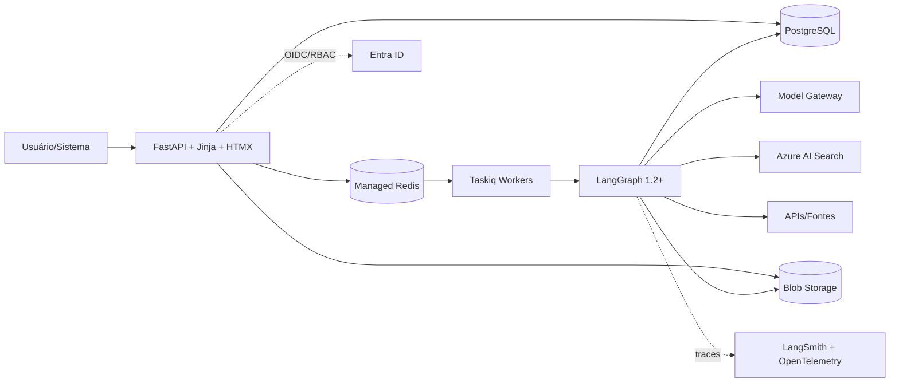
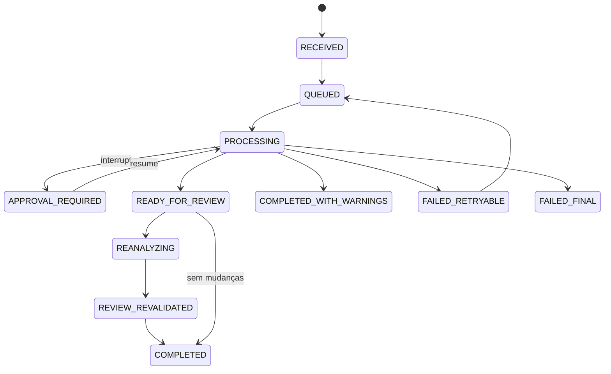
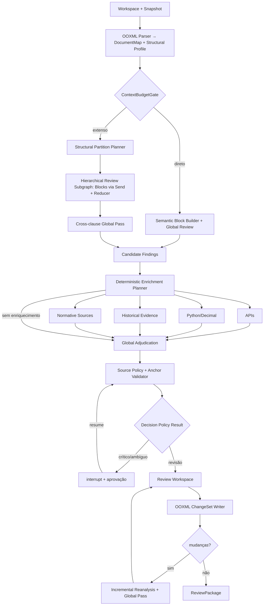

# Design Architecture: Contract Analyzer Enterprise

## 🎯 Objetivo (Problema de Negócio)
Automatizar, padronizar e auditar a revisão corporativa de contratos B2B, convertendo DOCX extensos, tabelas, anexos e revisões preexistentes em achados rastreáveis, redações sugeridas e decisões humanas verificáveis. A estação de trabalho confronta o `ContractWorkspace` com regras versionadas, cálculos Python, cadastros autorizados, fontes normativas controladas e histórico aprovado; executa revisão completa/focal, interação contextual, análise multi-documento, HITL e revisão Word, preservando contexto, referências cruzadas, autoria, vigência e proveniência. A IA não calcula, escolhe fontes silenciosamente, publica regras, aprova contratos, aplica mudanças críticas sozinha ou emite parecer conclusivo.

## 📌 Premissas e Decisões

| Domínio | Decisão arquitetural |
|---|---|
| **Orquestração/arquitetura** | LangGraph 1.2+ (`StateGraph`, estado tipado, `context_schema`, conditional edges, `Send`, reducers idempotentes, subgrafos, checkpoints, streaming, `interrupt()`/`Command(resume=...)`) sobre Ports & Adapters Azure-first/cloud-agnostic; sem ReAct/tools irrestritos. |
| **Workspace/documento/contexto** | `ContractWorkspace` contém DOCX principal editável e relacionados versionados. Python gera `DocumentMap` OOXML estável; IA cria `ReviewBlock`s semânticos ancorados. `ContextBudgetGate` escolhe revisão integral ou subgrafo hierárquico + passagem global; truncamento silencioso é proibido. |
| **Modos/regras** | FULL avalia todas as regras aplicáveis; FOCAL restringe regra/categoria/seção com expansão relacionada, sem chat aberto. `RuleRegistry` append-only registra escopo, vigência, aplicabilidade, criticidade, exceções, dependências, fontes e saída; cada run congela `RuleSnapshot`; conflitos obedecem `SourcePolicy` ou HITL. |
| **Modelos/execução** | Papéis lógicos `fast_structured`, `global_review`, `adjudication`, `specialized_reasoning`, `embedding`, selecionados por benchmark, contexto, custo e lifecycle. Saídas Pydantic/JSON Schema; Python valida IDs, enums, âncoras, budgets/retries e executa APIs, cálculos, retrieval, persistência e Writer. |
| **Evidências/decisão** | RAG fornece 0–3 exemplos históricos aprovados; normas/manuais são versionados, citáveis e sem web aberta. Similaridade, autoridade/frescor, criticidade, validações determinísticas e avaliação semântica permanecem sinais independentes. Python produz `DecisionPolicyResult(route, reasons, supporting_signals, blocking_conditions, approval_scope, bulk_eligible, reanalysis_required, policy_version)`; ausência/indisponibilidade nunca vira inferência, e nenhum número do LLM representa probabilidade jurídica. |
| **HITL/Word/saída** | Hard HITL pausa decisões críticas; Soft HITL usa comentários, Track Changes e round-trip. Sugestão é do sistema; reconhecer/rejeitar achado, aprovar/editar mudança, exceção e contrato são decisões humanas distintas, não assinatura digital. Original é imutável; `clean-internal` materializa mudanças aprovadas preservando somente identificadores técnicos autorizados, enquanto `clean-external` aplica `ExportPolicy` de sanitização; auditoria completa permanece no manifesto e na persistência. |
| **Reanálise/feedback** | Mudanças invalidam dependências; reanálise incremental inclui passagem global e escala para integral quando necessário. Resultados não revalidados ficam `STALE`. Lentes, criação de cláusula, bulk actions e promoção de feedback exigem comando/aprovação humana; nenhuma evolução autônoma. |
| **Organização** | Single-organization com isolamento interno por área, unidade, família contratual, jurisdição e grupo via Entra ID/RBAC; adapters locais preservam contratos. SaaS multi-tenant, billing e CLM completo ficam excluídos. |

## ⚙️ Escopo da Solução

* **In:** identidade; workspace; DOCX principal/relacionados; revisão FULL/FOCAL; lente; decisões; reimportação Word; feedback e integrações versionadas.
* **Core:** ingestão segura; OOXML → `DocumentMap`, `DocumentProfile`, `ReviewBlock`; revisão direta/hierárquica; enriquecimentos, adjudicação, HITL, Writer, round-trip, `EvidenceGraph`, reanálise e governança de regras/fontes/modelos.
* **Out:** portal FastAPI/Jinja/HTMX com fila, blocos, antes/depois, evidências, pílulas e histórico; APIs/webhooks; `ReviewPackage(original, redline, clean-internal, clean-external, findings, evidence, manifest, summary)`.
* **Fora do Escopo:** PDF/OCR/conversão fiel; perícia manuscrita/validação criptográfica; criação integral, negociação, assinatura e CLM; parecer conclusivo; web/SQL livres; SaaS multi-tenant; aprovação, publicação ou aprendizado autônomos.

## 👥 Usuários e Papéis

* **`reviewer`:** cria workspace, revisa, interage, decide achados, solicita redação, reanalisa e exporta; **`approver`:** resolve interrupções, exceções, alçadas, conflitos e mudanças materiais.
* **`rule_manager`:** elabora, simula, aprova, publica/retira regras, fontes e evidências; **`developer_admin`:** configura adapters, prompts, modelos, índices, retenção, traces, avaliações, conversores e testes adversariais.
* **Sistemas corporativos:** CLM/ERP/SharePoint/cadastros criam workspaces, fornecem metadados e consomem resultados por APIs/webhooks; serviços externos nunca interagem diretamente com o LLM.

## 🧩 Modelo de Domínio e Dados

### Infraestrutura

Docker; API/UI e workers separados em Azure Container Apps, rede privada e escala HTTP/queue; Docker Compose local. PostgreSQL mantém OLTP, registry, jobs, decisões, auditoria, dependências e `AsyncPostgresSaver`; Blob/MinIO guarda documentos/fontes/pacotes por hash; Redis é broker/cache efêmero; AI Search separa histórico/normas com busca lexical, vetorial e híbrida, filtros e ACL. Managed Identity, RBAC, Key Vault e minimização protegem acessos, segredos e telemetria.

### Entidades Principais

* **Estrutura:** `OrganizationScope`; `ContractWorkspace(primary, related, owner, retention)`; `DocumentRevision(parent, role, uri, hash, source, actor/time)`; `DocumentUnit(part, type, hierarchy, order, style, original/current/normalized, char_map, OOXML locator, events, unsupported_flags)`; `DocumentEvent(comment|insert|delete|change, author/time, range, before/after, status)`.
* **Semântica:** `ReviewBlock(type, unit_refs, relations, summary, construction, anchor_quality)`; `DocumentProfile` registra partes/papéis, objeto/tipo, idioma, datas/vigência/renovação, valores/moeda, foro, índices, anexos, signatários, seções, tabelas, referências, eventos, estruturas não suportadas e orçamento, sempre com evidências.
* **Governança:** `RuleRelease` reúne regra/versão, escopo, aplicabilidade, criticidade, comportamento, orientação, exceções, dependências, fontes, enriquecimentos, saída, vigência e aprovação; `SourcePolicy`, `PromptRelease`, `ModelPolicy` e `RuleSnapshot` congelam autoridade/configuração.
* **Execução/resultado:** `ReviewRun(workspace, thread, parent_run, INITIAL|FOCAL|REANALYSIS, scope, lens, snapshot, input/output revisions, graph/state versions, status)`; `RuleEvaluation` termina `COMPLIANT|FINDING|NOT_APPLICABLE|UNAVAILABLE|INSUFFICIENT_EVIDENCE`; `Finding` ancora regra, texto, risco qualitativo, avaliação semântica estruturada, unidades/ranges, relações, limitações e ação proposta; `DecisionPolicyResult` registra rota determinística, razões, sinais, bloqueios, escopo de aprovação, elegibilidade coletiva, reanálise e versão da policy; `Evidence` preserva tipo, fonte/versão, autoridade, vigência, hash, trecho, URL, similaridade, ACL e raw URI; `EnrichmentRequest/Result` registra inputs, tentativas, horário, resposta e erro.
* **Mudança/auditoria:** `ChangeProposal(operation, before, after, anchor, suggested_by, approval)`; `HumanDecision` distingue achado, mudança, exceção e contrato; `DependencyEdge` forma o `EvidenceGraph`; `InteractionThread` limita perguntas/`next_actions`; `ExecutionManifest`, `IntegrationEvent/Outbox` e `ReviewPackage` preservam hashes, versões, custos, limitações e entregáveis.
* **Estado:** `ContractState` checkpointa IDs, snapshots, mapas compactos, planos, avaliações, evidências, achados, decisões, invalidações, erros e métricas; XML/arquivos/payloads brutos ficam no storage. `Runtime Context` injeta adapters/policies; `RunnableConfig` leva `thread_id`, correlação e limites; reducers consolidam por identidade, nunca por soma cega.

O diagrama representa o ciclo lógico da revisão, não um único processo permanentemente ativo. Um `ReviewRun` inicial ou focal termina em `READY_FOR_REVIEW`; decisões humanas são comandos auditáveis. Hard HITL retoma a mesma `thread_id`, enquanto mudanças aplicadas ou DOCX reimportado criam nova `DocumentRevision` e `ReviewRun` filho (`run_kind=REANALYSIS`, `parent_run_id`). `RuleRelease: DRAFT→IN_REVIEW→PUBLISHED→RETIRED`; `DocumentRevision: ORIGINAL→SYSTEM_REDLINE/CLEAN_INTERNAL/CLEAN_EXTERNAL→HUMAN_REVISED→REVALIDATED`; `Resultado: CURRENT→STALE→RECALCULATING→SUPERSEDED/REVALIDATED`; nenhuma versão é sobrescrita.

## 🔌 Serviços de Aplicação e Integrações

* **Documento/revisão:** `DocxEnginePort` percorre OOXML, preserva comentários/revisões, mapeia normalizado→original→run e produz `DocumentMap` + `StructuralProfile`, inventariando conteúdo não suportado. Após o `ContextBudgetGate`, a revisão direta ou hierárquica cria `ReviewBlock`s ancorados e completa o `DocumentProfile`; nenhuma chamada global ao modelo ocorre antes da escolha de contexto. Não há agente por parágrafo. Lentes mudam prioridade/explicação, nunca fatos/regras; subgrafos especializados ou multiperspectiva exigem policy, benchmark e adjudicação neutra.
* **Enriquecimento:** regras + entidades validadas geram requests permitidos; pedidos do modelo passam por schema, allowlist, orçamento e limite de iterações. CPF/CNPJ, datas, placeholders, formatação, somas, faixas, alçadas, índices e tolerâncias usam Python/`Decimal`; APIs preservam timestamp, validade, payload e erro; divergências permanecem explícitas.
* **Conhecimento/redação:** histórico preserva parágrafo original/final, eventos humanos, regra, família, contraparte, escopo e aprovação/revogação; normas geram snapshots citáveis. RAG auxilia, nunca decide. `ClauseComposer`, sob comando, usa regras/fontes publicadas; metaprompt, reverse prompting e casos adversariais pertencem à avaliação supervisionada.
* **HITL/Word:** `DecisionPolicy` interrompe criticidade, exceção, alçada, conflito ou insuficiência configurada; retomada é idempotente. O sistema registra a autoria técnica das sugestões; o usuário decide sobre hash. `python-docx` trata operações DOCX de alto nível e comentários; leitura/reconciliação de revisões e o `OOXMLRevisionWriter` operam sobre OOXML (`lxml`/equivalente), sendo o Writer responsável por materializar Track Changes (`<w:ins>/<w:del>`) atrás de `DocxEnginePort`, sem busca aproximada; falha fina só recua ao parágrafo validado, senão `anchor_failure`. Redline preserva revisões; `clean-internal` aplica mudanças aprovadas e somente identificadores técnicos autorizados; `clean-external` remove metadados internos conforme `ExportPolicy`; reimportação cria nova revisão e reconcilia eventos humanos.
* **Reanálise/adapters:** alterações invalidam transitivamente via `EvidenceGraph`; `ReanalysisPlanner` escolhe incremental/integral, sempre com passagem global. Cache exige hashes/versões e TTL, nunca reutiliza conclusão entre contratos. Ports substituíveis cobrem storage, repositories/checkpoint, jobs, identidade, modelos, histórico/normas, validações externas, DOCX engine e telemetria.

## 📡 Contratos de API e Workers

* **Recursos:** `/workspaces`/documentos; `/reviews` para iniciar FULL/FOCAL, status/eventos, reanálise e `resume`; `/blocks|evaluations|findings|evidence` para consulta/interação; `/decisions` individual/lote com hash, criticidade e autorização; `/revisions/import`; `/packages/{original|redline|clean-internal|clean-external|manifest|evidence}`.
* **Governança/integração:** `/admin/rules` (`simulate|publish|retire`), `/admin/evidence` (`approve|revoke|reindex`), inspectors/evaluations restritos e webhooks versionados; mutações usam idempotency key, controle otimista e Outbox.
* **Workers:** revisão, resume/reanálise, pacote, ingestão histórica/normativa, simulação de regra, eventos e retenção; correlacionados, persistidos, idempotentes, com retry/dead-letter quando aplicável.

## 🛡️ Segurança e Restrições

* **IAM/LGPD:** OIDC/OAuth2, roles/grupos, menor privilégio, Managed Identity, Key Vault, TLS, egress/rede privada; minimização, classificação, retenção/exclusão, legal hold, auditoria e pseudonimização reversível seletiva segregada de traces/índices.
* **Upload/Writer:** aceitar só `.docx`; rejeitar `.docm`, MIME divergente, executáveis, traversal, ZIP bomb, expansão excessiva e relações externas não autorizadas; malware scan. Original imutável, cópias com hash/idempotência; `ExportPolicy` remove do `clean-external` comentários, revisões, propriedades pessoais, identidades de revisores, custom XML, hidden content e relações internas não autorizadas; clean/round-trip não equivalem a assinatura ou aprovação final.
* **IA/retrieval:** contrato, comentários, histórico e normas são dados não confiáveis; instruções separadas, retrieval sem autoridade e modelos sem OOXML, ACLs, segredos, mapas de identidade, payloads brutos, DML, código, browsing ou tools arbitrários.
* **Guardrails/auditoria:** budgets, timeouts, retries, circuit breakers, cancelamento e iterações máximas; trilha append-only de snapshots, hashes, modelos, prompts, regras, fontes, chamadas, decisões, exports e reprocessamentos, sem chain-of-thought; sem inferência em falha, retroatividade silenciosa, loops ou publicação autônoma.
* **Limites:** não substitui advogado, autoridade cadastral, perito grafotécnico ou verificador criptográfico; não autentica assinatura manuscrita, emite parecer conclusivo ou trata histórico/score como verdade universal.

## 🧪 Observabilidade, Testes e DoD

* **Telemetria/lifecycle:** LangSmith por run/nó/subgrafo + OpenTelemetry ponta a ponta; medir latência/erro, tokens/custo/cache, filas/retries/interrupções, disponibilidade, Recall@k/nDCG, precisão/recall/F1 por regra, âncoras, integridade/round-trip DOCX, reanálise e decisões. Mudanças de modelo, prompt, embedding, parser, Writer, índice, fonte ou regra exigem regressão e podem marcar `REPROCESS_RECOMMENDED`.
* **Suítes:** unitários de OOXML, regras, cálculos, policies, reducers, cache, dependências e autorização; Golden DOCX cobrindo corpo, tabelas, runs, links, headers/footers, comentários/revisões, repetições e estruturas especiais; grafo/semântica, retrieval/citações/ACL/injection, HITL/redline/clean/round-trip, segurança, concorrência, perda de worker, backup/restore e contratos extensos.

### Definition of Done

1. Workspace processa DOCX principal/relacionados, preserva revisões, declara conteúdo não suportado e mantém Source Trace até unidade/offset.
2. FULL/FOCAL avaliam `RuleSnapshot`; documentos extensos usam subgrafo hierárquico e passagem global sem truncamento.
3. LLMs retornam schemas; Python autoriza/executa APIs, cálculos, retrieval, ancoragem e Writer, com estados explícitos de conformidade, achado, inaplicabilidade, indisponibilidade e insuficiência.
4. Portal entrega blocos, contexto, evidências, interação, lentes, decisões separadas e Hard HITL; Writer gera original, redline, `clean-internal` e `clean-external` íntegros, autoria distinta e round-trip auditável.
5. Regras, fontes, evidências, feedback e modelos possuem escopo, vigência, snapshots, simulação/regressão e promoção supervisionada; dependências são invalidadas e nenhum pacote stale é tratado como revalidado.
6. Azure e ambiente local implementam os mesmos ports; CI comprova segurança, resiliência, qualidade semântica, custo, latência, integridade documental e rastreabilidade.

## 📎 Referências

* [LangGraph Graph API](https://docs.langchain.com/oss/python/langgraph/use-graph-api), [Subgraphs](https://docs.langchain.com/oss/python/langgraph/use-subgraphs), [Persistence](https://docs.langchain.com/oss/python/langgraph/persistence), [Interrupts](https://docs.langchain.com/oss/python/langgraph/interrupts), [Streaming](https://docs.langchain.com/oss/python/langgraph/event-streaming), [LangChain Structured Output](https://docs.langchain.com/oss/python/langchain/structured-output).
* [python-docx Comments](https://python-docx.readthedocs.io/en/latest/user/comments.html), [Open XML InsertedRun](https://learn.microsoft.com/en-us/dotnet/api/documentformat.openxml.wordprocessing.insertedrun), [Azure AI Search Hybrid/RAG/Access](https://learn.microsoft.com/en-us/azure/search/hybrid-search-overview).
* [Azure Container Apps](https://learn.microsoft.com/en-us/azure/container-apps/), [Blob + Entra](https://learn.microsoft.com/en-us/azure/storage/blobs/authorize-access-azure-active-directory), [PostgreSQL + Entra](https://learn.microsoft.com/en-us/azure/postgresql/security/security-entra-configure), [LangGraph Checkpointers](https://docs.langchain.com/oss/python/integrations/checkpointers), [Taskiq](https://taskiq-python.github.io/guide/architecture-overview.html), [HTMX SSE](https://htmx.org/extensions/sse/), [LGPD](https://www.planalto.gov.br/ccivil_03/_ato2015-2018/2018/lei/l13709.htm).
